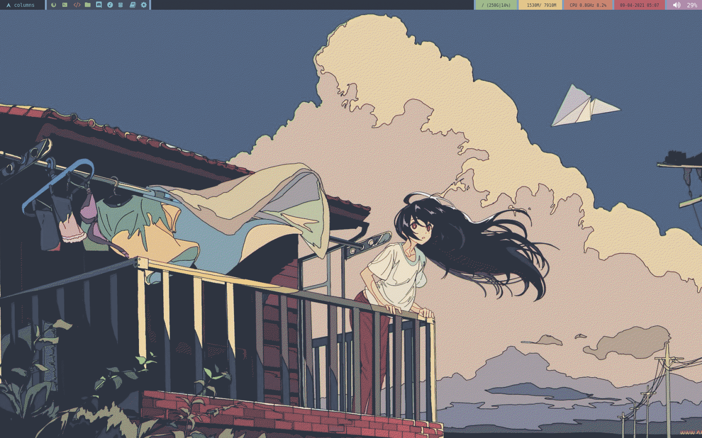
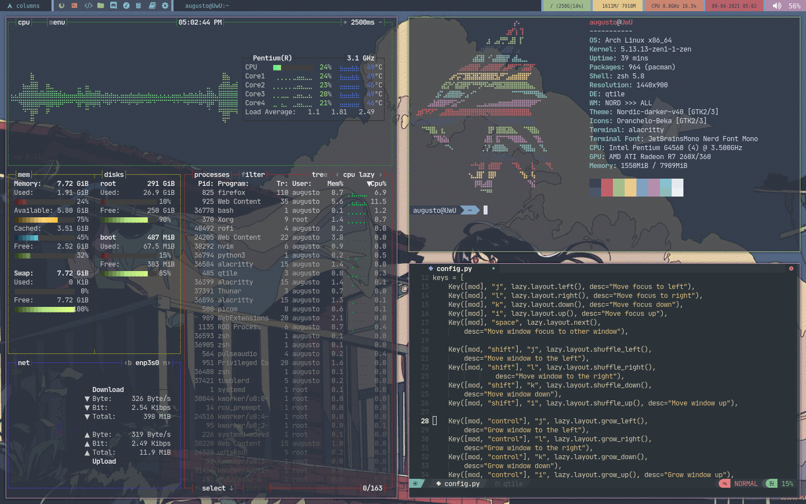
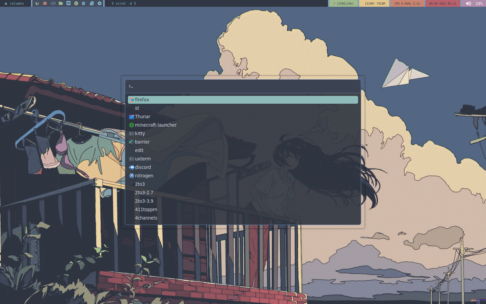
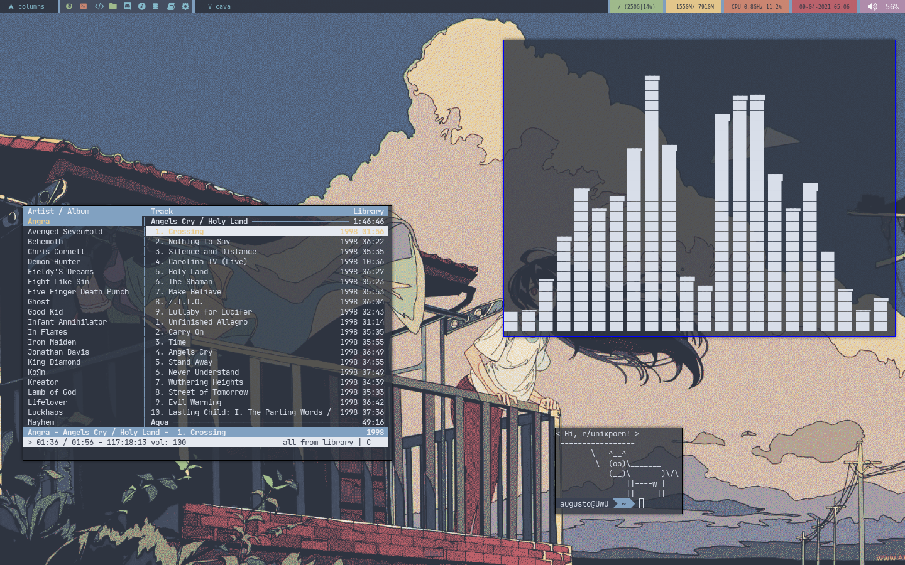

# my dotfiles

### qtile screenshots

### where i got some stuff

[rofi theme](https://github.com/undiabler/nord-rofi-theme)

[alacritty colorschemes nord/gruvbox](https://github.com/alacritty/alacritty/wiki/Color-schemes)

[wallpapers](https://github.com/linuxdotexe/nordic-wallpapers)

### apps

1. Terminal: Alacritty / ST.
2. Text editor: neovim with neovide.
3. Browser: Firefox.
4. App launcher: dmenu.
5. WM: Qtile / DWM.
6. OS: Artix / Void.
